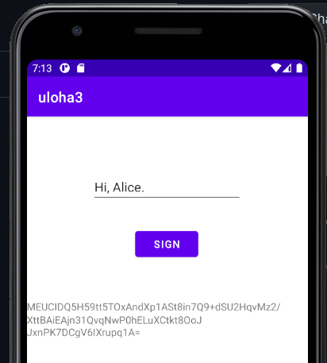

lepsie sa to pozera tu: [https://github.com/melnicek/notes/blob/master/ukol3.md](https://github.com/melnicek/notes/blob/master/ukol3.md)

# Problém 1: Analýza Android API pro kryptografické operace

Aplikacia obsahuje textfield `tMessage`, button `bSign`, a textview `tv0`



```java
public class MainActivity extends AppCompatActivity {

    @Override
    protected void onCreate(Bundle savedInstanceState) {
        super.onCreate(savedInstanceState);
        setContentView(R.layout.activity_main);
        Button bSign = (Button) findViewById(R.id.bSign);

        bSign.setOnClickListener(new View.OnClickListener() {
            @Override
            public void onClick(View view) {
                sign();
            }
        });

        try {
            KeyPairGenerator keyPairGenerator = KeyPairGenerator.getInstance(
                    KeyProperties.KEY_ALGORITHM_EC, "AndroidKeyStore");
            keyPairGenerator.initialize(
                    new KeyGenParameterSpec.Builder(
                            "key1",
                            KeyProperties.PURPOSE_SIGN)
                            .setAlgorithmParameterSpec(new ECGenParameterSpec("secp256r1"))
                            .setDigests(KeyProperties.DIGEST_SHA256,
                                    KeyProperties.DIGEST_SHA384,
                                    KeyProperties.DIGEST_SHA512)
                            .build());
        } catch (Exception e) { // sakredy catch
            e.printStackTrace();
        }
    }
    
    protected  void sign(){
        TextView tv0 = (TextView) findViewById(R.id.tv0);
        TextView tMessage = (TextView) findViewById(R.id.tMessage);
        String sign_me = tMessage.getText().toString();

        try {
            KeyStore keyStore = KeyStore.getInstance("AndroidKeyStore");
            keyStore.load(null);
            
            Signature signature = Signature.getInstance("SHA256withECDSA");
            signature.initSign((PrivateKey) keyStore.getKey("key1", null));
            signature.update(sign_me.getBytes("UTF-8")); // used getBytes to change string to byte[]
            
            tv0.setText(Base64.encodeToString(signature.sign(), Base64.DEFAULT));
        } catch (Exception e) { // dalsi skaredy catch
            e.printStackTrace();
        }
    }
}
```

# Problém 2: Analýza aplikace pro SMPC


# Problém 3: Rozhraní NFC
